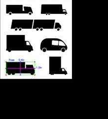

# Team-Project
### ***Project name***: Vehicle height measuring device using object size measurement open source

#### It uses an object sizing machine to measure the size of the car and determines whether the car can pass through any tunnel or section.
---
## Result image
Car height meter result image:

---
## **Requirements:**
1. python          (3.7.3)
2. opencv          (4.1.0)
3. numpy           (1.61.4)
4. imutils         (0.5.2)
---
## how to run
```sh
python car_height.py --image images/cars.jpg --width 0.955
```
## reference material:
### We made it by referring to [Measuring-Size-of-Objects](https://github.com/Practical-CV/Measuring-Size-of-Objects-with-OpenCV)-with-OpenCV by hackbansu.
---
